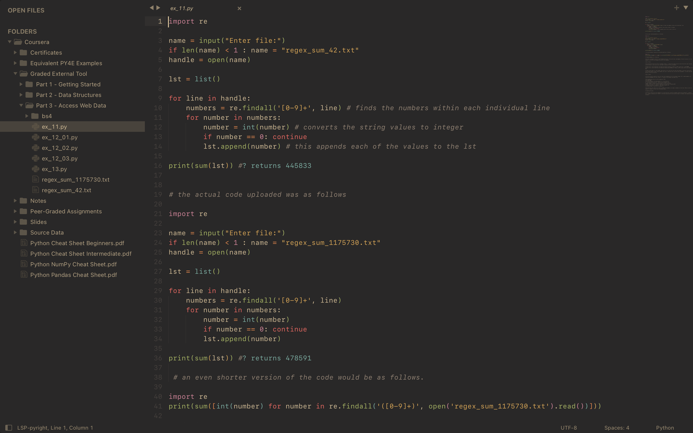

## Gruvbox Material

This theme is a port of [Gruvbox Material](https://github.com/gruvbox-material/gruvbox-material) for Sublime Text 4.

## Dark



Gruvbox Material is a modified version of [Gruvbox](https://github.com/morhetz/gruvbox), the contrast is adjusted to be softer in order to protect developers' eyes.

A light version will follow, I just need to find some free time to put it together.

## Installation

**Easy:**

1. Open `Command Palette` using the menu item `Tools → Command Palette` or <kbd>CMD/CTRL</kbd> + <kbd>SHIFT</kbd> +<kbd>P</kbd>.
2. Choose `Package Control: Install Package`.
3. Type `Gruvbox Material Theme` and press <kbd>ENTER</kbd>.

**Manually:**

1. Download the latest release and unzip. it into your Packages folder.
2. Go to `Sublime Text → Preferences → Browse Packages`.
3. Rename the folder to `Gruvbox Material Theme`.

## Activate Theme

**You can active this theme from:**

1. Command Palette `Tools → Command Palette` or <kbd>CMD/CTRL</kbd> + <kbd>SHIFT</kbd> + <kbd>P</kbd>.
2. Type `UI: Select Theme` locate `Gruvbox Material Dark.sublime-theme` and press <kbd>ENTER</kbd>.
3. Type `UI: Select Color Scheme` locate `Gruvbox Material Dark` and press <kbd>ENTER</kbd>.

Manually you can go to (**Preferences > Settings - User**) and paste the following code:

```json
{
    "theme": "Gruvbox Material Dark.sublime-theme"
    "color_scheme": "Packages/Gruvbox Material Theme/Gruvbox Material Dark/Gruvbox Material Dark.sublime-color-scheme",
}
```

## Sidebar Icons

The theme looks best with [FileIcons](https://github.com/braver/FileIcons) in greyscale, but overriding is possible.

## Related Projects

See this [wiki page](https://github.com/sainnhe/gruvbox-material/wiki/Related-Projects).

## Credits

- The color palette is based on [gruvbox](https://github.com/morhetz/gruvbox) by [@morhetz](https://github.com/morhetz)
- The color palette is adjusted by [@sainnhe](https://github.com/sainnhe)

## License

[MIT](https://en.wikipedia.org/wiki/MIT_License)
